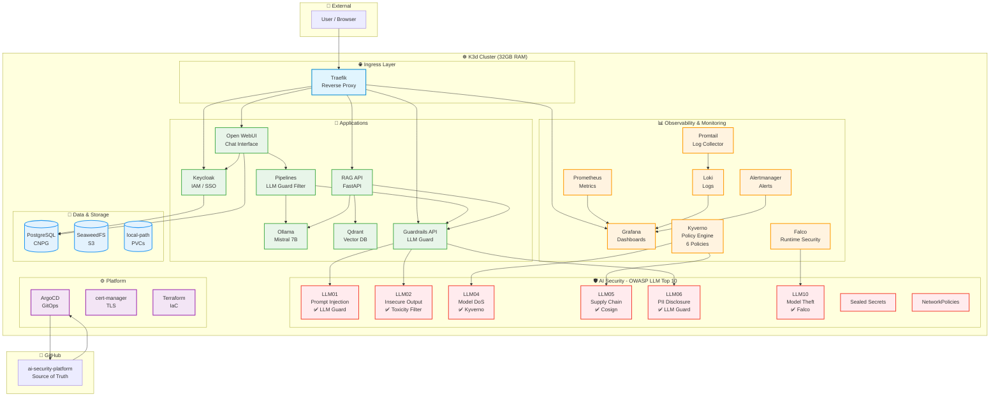

# AI Security Platform - Architecture

## Components Summary

| Layer | Components | Namespace |
|-------|------------|-----------|
| **Ingress** | Traefik | kube-system |
| **Applications** | Open WebUI, Pipelines, Keycloak, Ollama, Qdrant, RAG API, Guardrails | ai-apps, ai-inference, auth |
| **Security** | LLM Guard, Sealed Secrets, NetworkPolicies, PSS | ai-inference, security |
| **Observability** | Prometheus, Grafana, Loki, Falco, Kyverno | observability, falco, kyverno |
| **Storage** | PostgreSQL (CNPG), SeaweedFS, local-path | storage |
| **Platform** | ArgoCD, cert-manager | argocd, cert-manager |

## OWASP LLM Top 10 Coverage

| Risk | Status | Mitigation |
|------|--------|------------|
| LLM01: Prompt Injection | ✅ | LLM Guard + Pipelines |
| LLM02: Insecure Output | ✅ | LLM Guard Toxicity |
| LLM03: Training Data Poisoning | ✅ | Model pinning (Ollama) |
| LLM04: Model DoS | ✅ | Kyverno resource limits |
| LLM05: Supply Chain | ✅ | Kyverno + Cosign |
| LLM06: PII Disclosure | ✅ | LLM Guard PII redaction |
| LLM07: Insecure Plugin | ✅ | N/A (no plugins) |
| LLM08: Excessive Agency | 🔲 | Planned (NeMo) |
| LLM09: Overreliance | 🔲 | Planned |
| LLM10: Model Theft | ✅ | Falco + NetworkPolicies |

## Access URLs

| Service | URL |
|---------|-----|
| ArgoCD | https://argocd.ai-platform.localhost |
| Keycloak | https://auth.ai-platform.localhost |
| Open WebUI | https://chat.ai-platform.localhost |
| Grafana | https://grafana.ai-platform.localhost |
| Prometheus | https://prometheus.ai-platform.localhost |
| RAG API | https://rag.ai-platform.localhost |
| Guardrails | https://guardrails.ai-platform.localhost |
