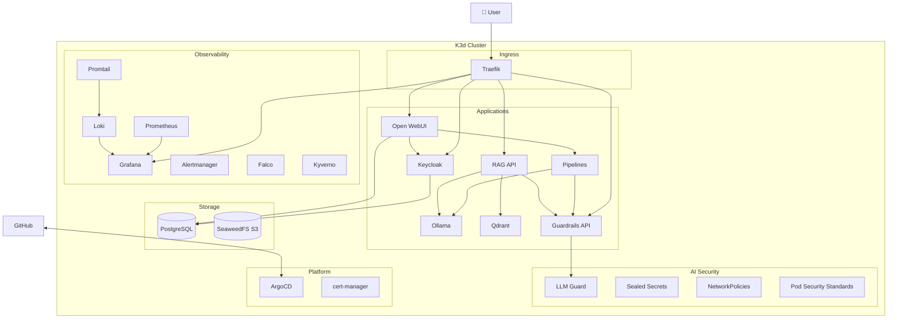

# AI Security Platform - Architecture

---

## Namespaces

| Namespace | Components |
|-----------|------------|
| ai-apps | Open WebUI, Pipelines |
| ai-inference | Ollama, Qdrant, RAG API, Guardrails |
| auth | Keycloak |
| storage | PostgreSQL, SeaweedFS |
| observability | Prometheus, Grafana, Alertmanager, Loki, Promtail |
| falco | Falco |
| kyverno | Kyverno |
| argocd | ArgoCD |
| cert-manager | cert-manager |

---

## OWASP LLM Top 10

| Risk | Status | Mitigation |
|------|:------:|------------|
| LLM01 Prompt Injection | ✅ | LLM Guard |
| LLM02 Insecure Output | ✅ | LLM Guard Toxicity |
| LLM03 Training Data Poisoning | ✅ | Model pinning |
| LLM04 Model DoS | ✅ | Kyverno resource limits |
| LLM05 Supply Chain | ✅ | Kyverno + Cosign |
| LLM06 PII Disclosure | ✅ | LLM Guard |
| LLM07 Insecure Plugin | ✅ | N/A |
| LLM08 Excessive Agency | 🔲 | Planned |
| LLM09 Overreliance | 🔲 | Planned |
| LLM10 Model Theft | ✅ | Falco + NetworkPolicies |

---

## URLs

| Service | URL |
|---------|-----|
| ArgoCD | https://argocd.ai-platform.localhost |
| Keycloak | https://auth.ai-platform.localhost |
| Open WebUI | https://chat.ai-platform.localhost |
| Grafana | https://grafana.ai-platform.localhost |
| Prometheus | https://prometheus.ai-platform.localhost |
| RAG API | https://rag.ai-platform.localhost |
| Guardrails | https://guardrails.ai-platform.localhost |
