# AI Security Platform - Architecture

```mermaid
flowchart TB
    subgraph EXTERNAL["👤 External"]
        USER[User / Browser]
    end

    subgraph CLUSTER["☸️ K3d Cluster - 32GB RAM"]
        
        subgraph INGRESS["🌐 INGRESS"]
            TRAEFIK["<b>Traefik</b><br/>Reverse Proxy"]
        end

        subgraph APPS["🚀 APPLICATIONS"]
            WEBUI["<b>Open WebUI</b><br/>Chat Interface"]
            PIPELINES["<b>Pipelines</b><br/>LLM Guard Filter"]
            KEYCLOAK["<b>Keycloak</b><br/>IAM / SSO"]
            OLLAMA["<b>Ollama</b><br/>Mistral 7B"]
            QDRANT["<b>Qdrant</b><br/>Vector DB"]
            RAGAPI["<b>RAG API</b><br/>FastAPI"]
            GUARDRAILS["<b>Guardrails</b><br/>LLM Guard"]
        end

        subgraph SECURITY["🛡️ AI SECURITY - OWASP LLM"]
            LLM01["<b>LLM01</b><br/>Prompt Injection ✅"]
            LLM02["<b>LLM02</b><br/>Insecure Output ✅"]
            LLM04["<b>LLM04</b><br/>Model DoS ✅"]
            LLM05["<b>LLM05</b><br/>Supply Chain ✅"]
            LLM06["<b>LLM06</b><br/>PII Disclosure ✅"]
            LLM10["<b>LLM10</b><br/>Model Theft ✅"]
            SECRETS["<b>Sealed Secrets</b>"]
            NETPOL["<b>NetworkPolicies</b>"]
        end

        subgraph OBSERVABILITY["📊 OBSERVABILITY"]
            PROMETHEUS["<b>Prometheus</b><br/>Metrics"]
            GRAFANA["<b>Grafana</b><br/>Dashboards"]
            ALERTMANAGER["<b>Alertmanager</b><br/>Alerts"]
            LOKI["<b>Loki</b><br/>Logs"]
            FALCO["<b>Falco</b><br/>Runtime Security"]
            KYVERNO["<b>Kyverno</b><br/>6 Policies"]
        end

        subgraph STORAGE["💾 STORAGE"]
            POSTGRESQL[("<b>PostgreSQL</b><br/>CNPG")]
            SEAWEEDFS[("<b>SeaweedFS</b><br/>S3")]
        end

        subgraph PLATFORM["⚙️ PLATFORM"]
            ARGOCD["<b>ArgoCD</b><br/>GitOps"]
            CERTMANAGER["<b>cert-manager</b><br/>TLS"]
        end

    end

    subgraph GITHUB["🐙 GitHub"]
        REPO["<b>ai-security-platform</b><br/>Source of Truth"]
    end

    %% Main Flow
    USER ==> TRAEFIK
    TRAEFIK --> WEBUI
    TRAEFIK --> KEYCLOAK
    TRAEFIK --> GRAFANA
    TRAEFIK --> RAGAPI
    
    WEBUI --> PIPELINES
    PIPELINES --> GUARDRAILS
    PIPELINES --> OLLAMA
    WEBUI -.-> KEYCLOAK
    
    RAGAPI --> GUARDRAILS
    RAGAPI --> QDRANT
    RAGAPI --> OLLAMA
    
    GUARDRAILS -.-> LLM01
    GUARDRAILS -.-> LLM02
    GUARDRAILS -.-> LLM06
    
    KYVERNO -.-> LLM04
    KYVERNO -.-> LLM05
    FALCO -.-> LLM10
    
    PROMETHEUS --> GRAFANA
    LOKI --> GRAFANA
    
    KEYCLOAK --> POSTGRESQL
    WEBUI --> POSTGRESQL
    
    ARGOCD <--> REPO

    %% Styling - High Contrast
    style INGRESS fill:#1565c0,stroke:#0d47a1,stroke-width:3px,color:#ffffff
    style APPS fill:#2e7d32,stroke:#1b5e20,stroke-width:3px,color:#ffffff
    style SECURITY fill:#c62828,stroke:#b71c1c,stroke-width:3px,color:#ffffff
    style OBSERVABILITY fill:#ef6c00,stroke:#e65100,stroke-width:3px,color:#ffffff
    style STORAGE fill:#6a1b9a,stroke:#4a148c,stroke-width:3px,color:#ffffff
    style PLATFORM fill:#37474f,stroke:#263238,stroke-width:3px,color:#ffffff
    style CLUSTER fill:#fafafa,stroke:#424242,stroke-width:4px
    style EXTERNAL fill:#e8f5e9,stroke:#2e7d32,stroke-width:2px
    style GITHUB fill:#24292e,stroke:#000000,stroke-width:2px,color:#ffffff
    
    style TRAEFIK fill:#0288d1,stroke:#01579b,color:#ffffff
    style WEBUI fill:#43a047,stroke:#2e7d32,color:#ffffff
    style PIPELINES fill:#66bb6a,stroke:#43a047,color:#ffffff
    style KEYCLOAK fill:#43a047,stroke:#2e7d32,color:#ffffff
    style OLLAMA fill:#43a047,stroke:#2e7d32,color:#ffffff
    style QDRANT fill:#43a047,stroke:#2e7d32,color:#ffffff
    style RAGAPI fill:#43a047,stroke:#2e7d32,color:#ffffff
    style GUARDRAILS fill:#43a047,stroke:#2e7d32,color:#ffffff
    
    style LLM01 fill:#d32f2f,stroke:#b71c1c,color:#ffffff
    style LLM02 fill:#d32f2f,stroke:#b71c1c,color:#ffffff
    style LLM04 fill:#d32f2f,stroke:#b71c1c,color:#ffffff
    style LLM05 fill:#d32f2f,stroke:#b71c1c,color:#ffffff
    style LLM06 fill:#d32f2f,stroke:#b71c1c,color:#ffffff
    style LLM10 fill:#d32f2f,stroke:#b71c1c,color:#ffffff
    style SECRETS fill:#e57373,stroke:#d32f2f,color:#000000
    style NETPOL fill:#e57373,stroke:#d32f2f,color:#000000
    
    style PROMETHEUS fill:#fb8c00,stroke:#ef6c00,color:#ffffff
    style GRAFANA fill:#fb8c00,stroke:#ef6c00,color:#ffffff
    style ALERTMANAGER fill:#fb8c00,stroke:#ef6c00,color:#ffffff
    style LOKI fill:#fb8c00,stroke:#ef6c00,color:#ffffff
    style FALCO fill:#ff5722,stroke:#e64a19,color:#ffffff
    style KYVERNO fill:#ff5722,stroke:#e64a19,color:#ffffff
    
    style POSTGRESQL fill:#7b1fa2,stroke:#6a1b9a,color:#ffffff
    style SEAWEEDFS fill:#7b1fa2,stroke:#6a1b9a,color:#ffffff
    
    style ARGOCD fill:#546e7a,stroke:#37474f,color:#ffffff
    style CERTMANAGER fill:#546e7a,stroke:#37474f,color:#ffffff
    
    style USER fill:#ffffff,stroke:#2e7d32,stroke-width:2px,color:#000000
    style REPO fill:#ffffff,stroke:#24292e,color:#000000
```

---

## 📋 Components by Namespace

| Namespace | Components |
|-----------|------------|
| **kube-system** | Traefik |
| **ai-apps** | Open WebUI, Pipelines |
| **ai-inference** | Ollama, Qdrant, RAG API, Guardrails API |
| **auth** | Keycloak |
| **storage** | PostgreSQL (CNPG), SeaweedFS |
| **observability** | Prometheus, Grafana, Alertmanager, Loki, Promtail |
| **falco** | Falco |
| **kyverno** | Kyverno, 6 ClusterPolicies |
| **argocd** | ArgoCD |
| **cert-manager** | cert-manager |

---

## 🛡️ OWASP LLM Top 10 Coverage

| Risk | Status | Mitigation |
|------|:------:|------------|
| **LLM01** Prompt Injection | ✅ | LLM Guard PromptInjection scanner |
| **LLM02** Insecure Output | ✅ | LLM Guard Toxicity + NoRefusal |
| **LLM03** Training Data Poisoning | ✅ | Model pinning (Ollama) |
| **LLM04** Model DoS | ✅ | Kyverno require-resource-limits |
| **LLM05** Supply Chain | ✅ | Kyverno disallow-latest-tag + Cosign |
| **LLM06** PII Disclosure | ✅ | LLM Guard Sensitive scanner |
| **LLM07** Insecure Plugin | ✅ | N/A (no plugins in scope) |
| **LLM08** Excessive Agency | 🔲 | Planned (NeMo Guardrails) |
| **LLM09** Overreliance | 🔲 | Planned |
| **LLM10** Model Theft | ✅ | Falco + NetworkPolicies |

**Coverage: 8/10** ✅

---

## 🔗 Access URLs

| Service | URL | Auth |
|---------|-----|------|
| **ArgoCD** | https://argocd.ai-platform.localhost | admin |
| **Keycloak** | https://auth.ai-platform.localhost | admin |
| **Open WebUI** | https://chat.ai-platform.localhost | Keycloak SSO |
| **Grafana** | https://grafana.ai-platform.localhost | admin / admin123! |
| **Prometheus** | https://prometheus.ai-platform.localhost | - |
| **Alertmanager** | https://alertmanager.ai-platform.localhost | - |
| **RAG API** | https://rag.ai-platform.localhost/docs | - |
| **Guardrails** | https://guardrails.ai-platform.localhost/docs | - |

---

## 📊 Resource Summary

| Category | RAM Used |
|----------|----------|
| Applications | ~6 GB |
| Observability | ~2.5 GB |
| Security (Falco, Kyverno) | ~1 GB |
| Storage | ~1.5 GB |
| Platform | ~1 GB |
| **Total** | **~12 GB** |

---

*Author: Z3ROX | [github.com/Z3ROX-lab/ai-security-platform](https://github.com/Z3ROX-lab/ai-security-platform)*
