# Phase 1: Architecture Diagram

## Overview

## Component Details

| Component | Purpose | Resource |
|-----------|---------|----------|
| **K3d Cluster** | Kubernetes in Docker | ~500MB RAM |
| **Control Plane** | Cluster management | 1 server node |
| **Worker Nodes** | Run workloads | 2 agent nodes |
| **ArgoCD** | GitOps deployment | ~512MB RAM |
| **Local Registry** | Store custom images | registry.localhost:5000 |

## Network Flow

```mermaid
flowchart LR
    subgraph EXTERNAL["External Access"]
        USER["👤 User"]
    end
    
    subgraph PORTS["Exposed Ports"]
        P80[":80 HTTP"]
        P443[":443 HTTPS"]
        P9090[":9090 ArgoCD"]
        P5000[":5000 Registry"]
    end
    
    subgraph K3D["K3d Cluster"]
        LB["Load Balancer"]
        ARGO["ArgoCD UI"]
        REG["Container Registry"]
    end
    
    USER --> P80 --> LB
    USER --> P443 --> LB
    USER --> P9090 --> ARGO
    USER --> P5000 --> REG
    
    %% Styling
    classDef user fill:#2563eb,stroke:#fff,stroke-width:2px,color:#fff
    classDef ports fill:#dc2626,stroke:#fff,stroke-width:2px,color:#fff
    classDef cluster fill:#059669,stroke:#fff,stroke-width:2px,color:#fff
    
    class USER user
    class P80,P443,P9090,P5000 ports
    class LB,ARGO,REG cluster
```

## GitOps Flow

```mermaid
sequenceDiagram
    participant DEV as 👤 Developer
    participant GIT as 📁 GitHub
    participant ARGO as 🔶 ArgoCD
    participant K8S as ☸️ Kubernetes
    
    DEV->>GIT: 1. git push (manifests)
    GIT-->>ARGO: 2. Webhook/Poll
    ARGO->>ARGO: 3. Detect changes
    ARGO->>GIT: 4. Fetch manifests
    ARGO->>K8S: 5. Apply changes
    K8S-->>ARGO: 6. Status update
    ARGO-->>DEV: 7. Sync status (UI)
```

## Terraform Resources

```mermaid
flowchart TD
    TF["🔧 Terraform"]
    CLUSTER["☸️ k3d_cluster.ai_platform"]
    
    TF -->|creates| CLUSTER
    
    CLUSTER --> SERVER["🖥️ 1 Server Node"]
    CLUSTER --> AGENTS["🖥️ 2 Agent Nodes"]
    CLUSTER --> LB["⚖️ Load Balancer"]
    CLUSTER --> REGISTRY["📦 Local Registry"]
    
    SERVER --> PORT80[":80"]
    SERVER --> PORT443[":443"]
    SERVER --> PORT8080[":8080"]
    REGISTRY --> PORT5000[":5000"]
    
    %% Styling
    classDef terraform fill:#7c3aed,stroke:#fff,stroke-width:2px,color:#fff
    classDef cluster fill:#0891b2,stroke:#fff,stroke-width:2px,color:#fff
    classDef resource fill:#0d9488,stroke:#fff,stroke-width:2px,color:#fff
    classDef port fill:#f59e0b,stroke:#000,stroke-width:2px,color:#000
    
    class TF terraform
    class CLUSTER cluster
    class SERVER,AGENTS,LB,REGISTRY resource
    class PORT80,PORT443,PORT8080,PORT5000 port
```

## Architecture Legend

| Color | Meaning |
|-------|---------|
| 🔵 **Dark Blue** | Control Plane components |
| 🟢 **Dark Green** | Worker Nodes |
| 🟤 **Brown** | ArgoCD components |
| 🟣 **Purple** | Terraform |
| 🔷 **Cyan** | Cluster resources |
| 🟡 **Yellow** | Exposed ports |

## Current State

| Resource | Status | Access |
|----------|--------|--------|
| K3d Cluster | ✅ Running | `kubectl get nodes` |
| ArgoCD | ✅ Running | https://localhost:9090 |
| GitHub Connection | ✅ Connected | ArgoCD → Settings → Repos |
| Local Registry | ✅ Running | registry.localhost:5000 |

## Next Phase

Phase 2 will add:
- PostgreSQL (database layer)
- MinIO (object storage)
- Deployed via ArgoCD GitOps